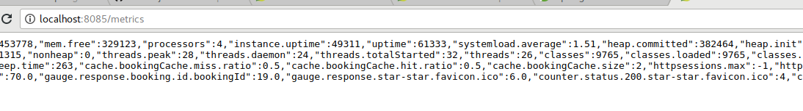

# springboot-ehcache-example

This project demonstrates how to implement Ehcahe in Springboot application.

In this example,

By using Ehcache in springboot, you can avoid to hit database multiple times to fetch records.

It will increase the performance to avoid hitting database multiple times.

In this scenario,

    * The application retreived booking details information from the mysql.
    * When we hit the service operation to fetch the records for the first time it will go to dao layer and fetch the records.
    * If we hit the same operations for the next time, it will not go to dao layer and fetch the records instead it will use the Ehcache for that.
    
# Keypoints to remember

   * ehcahe.xml
   * application.properties
   * pom.xml
   
   ```
        <dependency>
			<groupId>net.sf.ehcache</groupId>
			<artifactId>ehcache</artifactId>
		</dependency>
```
   
   ```
   <?xml version="1.0" encoding="UTF-8"?>
   <ehcache xmlns:xsi="http://www.w3.org/2001/XMLSchema-instance"
            xsi:noNamespaceSchemaLocation="http://www.ehcache.org/ehcache.xsd"
            updateCheck="true"
            monitoring="autodetect"
            dynamicConfig="true">
   
       <cache name="bookingCache"
              maxElementsInMemory="100"
              eternal="false"
              overflowToDisk="false"
              timeToLiveSeconds="300"
              timeToIdleSeconds="0"
              memoryStoreEvictionPolicy="LFU"
              transactionalMode="off">
       </cache>
   </ehcache>

```
     
```
  spring.cache.ehcache.config=classpath:ehcache.xml
```

``` 
@Cacheable(value = "bookingCache",key = "#bookingId", unless = "#result==null")

```
### Reference Link
[Spring book Cache](https://docs.spring.io/spring-boot/docs/current/reference/html/boot-features-caching.html)

### Screenshot



### Happy Coding